# 第九章 EM算法及其推广

## 本章概要

1. EM算法是⼀种迭代算法，用于含有隐变量的概率模型参数的极大似然估计，或极大后验概率估计

2. EM算法可以用于生成模型的非监督学习

3. 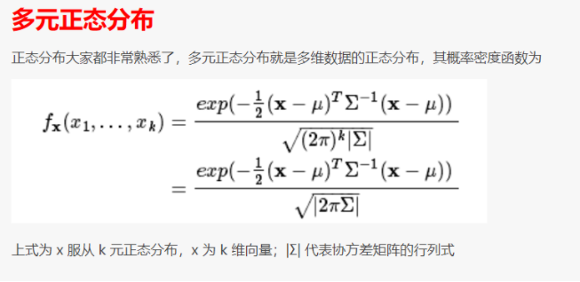

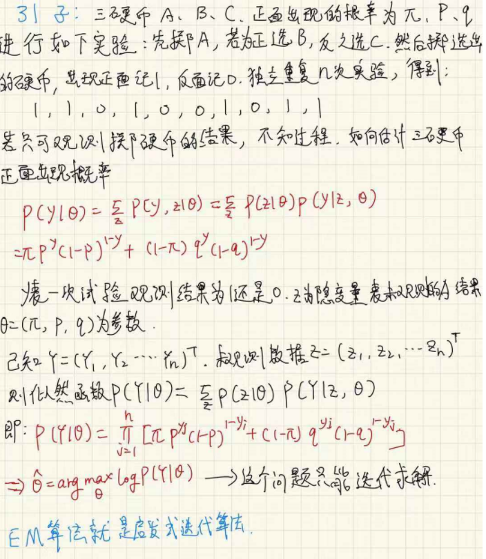

## EM算法

输入：观测变量数据Y，隐变量数据Z，联合分布P(Y，Z|θ )，条件分布P(Z|Y,θ )

输出：模型的参数θ

1. 选择参数的初值 $θ^{(0)}$，开始迭代，不同的初值会影响结果

2. E步：记$θ^{(i)}$为第i次迭代参数的估计值，在第i+1次的迭代的E步，计算
   $$
   Q(θ,θ^{(i)})=E_z[\log P(Y,Z|θ)|Y,θ^{(i)}]=\sum_Z\log P(Y,Z|θ)P(Z|Y,θ^{(i)})
   $$
   这里，$P(Z|Y,θ^{(i)})$是在给定观测数据Y和当前参数θ下隐变量数据Z的条件概率分布

3. M步：求使$Q(θ,θ^{(i)})$极大化的θ，确定第i+1次迭代的参数的估计值$θ^{(i+1)}=arg\max_θQ(θ,θ^{(i)})$

4. 重复第二第三步，直到收敛

上述算法中，Q函数是EM算法的核心，为完全数据的对数似然函数$logP(Y，Z|θ )$关于在给定观测数据Y和当前参数θ下对未观测数据Z的条件概率分布$P(Z|Y,θ^{(i)})$的期望

停止迭代的条件⼀般是对较小的正数，若满足下式则停止

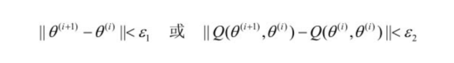

## EM算法—高斯混合模型

高斯混合模型指具有如下形式的分布模型：其中ak≥0，$\sum_{k=1}^{K}a_k=1$;后者为高斯分布密度，参数θ为均值和方差，EM算法可以很好的骨估计高斯混合模型的参数
$$
P(y|θ)=\sum_{k=1}^{K}a_k∅(y|θ_k)
$$

1. 明确隐变量，写出完全数据的对数似然函数

   设想观测数据yj ，j＝1,2,…,N，是这样产生的：首先依概率ak选择第k个高斯分布分模型Ø(y| k)；然后依第k个分模型的概率分布Ø(y| k)生成观测数据yj 。这时观测数据yj是已知的；反映观测数据yj 来自第k个分模型的数据是未知的，k＝1,2,…,K，以隐变量$γ_{jk}$表示，其定义如下：

   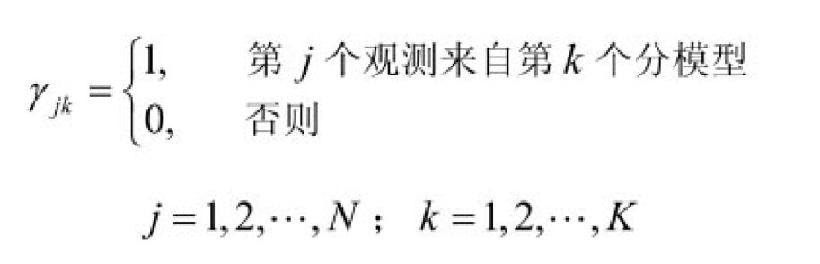

   观测数据和隐函数据组成**完全数据**$(y_j,γ_{j1},\cdots,γ_{jK}),j=1,2,\cdots,N$，于是可以写出完全数据的似然函数
   
   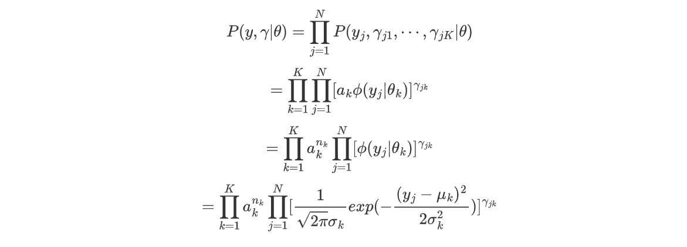
   
   其中，$n_k=\sum_{j=1}^{N}γ_{jk},\sum_{k=1}^{K}n_k=N$，那么完全数据的对数似然函数就为
   $$
   \log P(y,γ|θ)=\sum_{k=1}^{K}n_k\log a_k+\sum_{j=1}^{N}γ_{jk}[log(\frac{1}{\sqrt{2\pi}})-\log \sigma_k-\frac{1}{2\sigma^2}(y_j-\mu_k)^2]
   $$
   
2. EM算法的E步，确定Q函数
   
   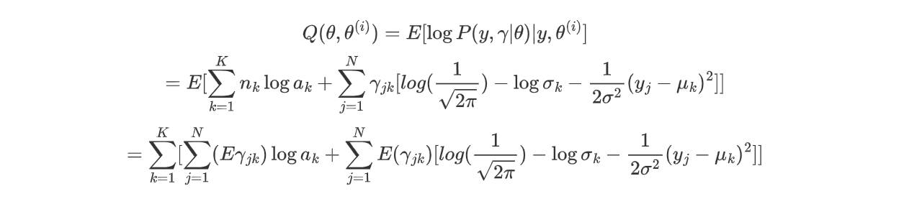
   
   这里需要计算$E(γ_{jk}|y,θ)$，记为$\hat{\gamma}_{jk}$，这个量是在当前模型参数下第j个观测数据来自第k个分模型的概率
   
   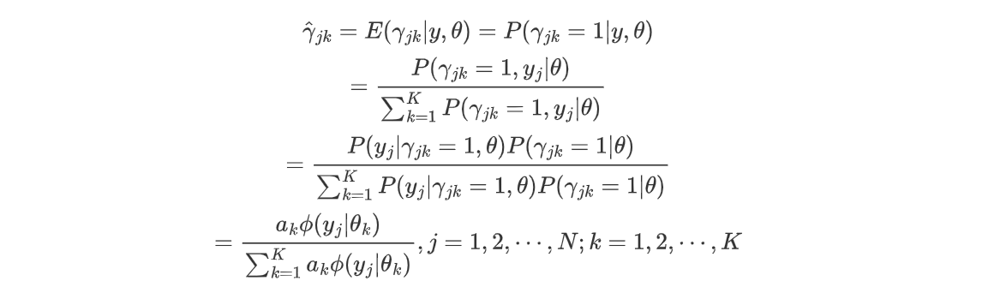
   
   将$\hat{\gamma}_{jk}=E\gamma_{jk},n_k=\sum_{j=1}^{N}E\gamma_{jk}$代入$Q(θ,θ^{(i)})$，得到
   $$
   Q(θ,θ^{(i)})=\sum_{k=1}^{K}n_k\log a_k+\sum_{j=1}^{N}γ_{jk}[log(\frac{1}{\sqrt{2\pi}})-\log \sigma_k-\frac{1}{2\sigma^2}(y_j-\mu_k)^2]
   $$
   
3. 确定EM算法的M步，是求函数Q对θ的极大值，即
   $$
   \theta^{(i+1)}=\arg \max_\theta Q(\theta,\theta^{(i)})
   $$
   用$\hat{\mu_k},\hat{\sigma_k^2},\hat{a_k}$表示$\theta^{(i+1)}$的各个参数。求前两者只需将Q（θ，θi）分别对它们求偏导数并令其为0，即可得到；求$\hat{a_k}$k 是在$\sum_{k=1}^{K}a_k=1$条件下求偏导数并令其为0得到的。结果如下:

   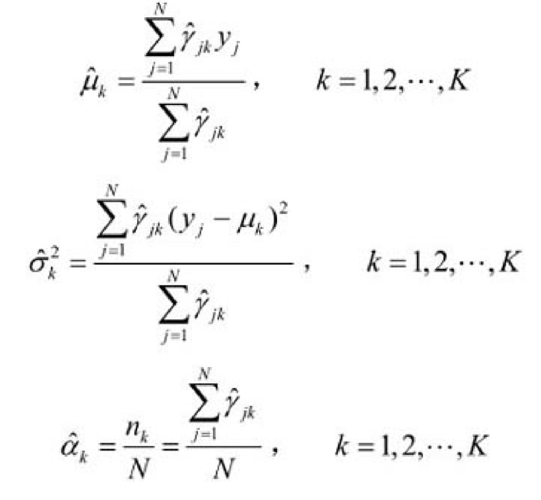

   重复以上计算，直到对数似然函数值不再有明显的变化为止

故整体算法实现描述如下：

输入：观测数据y1 ,y2 ,…,yN ，高斯混合模型

输出：高斯混合模型参数

1. 取参数初值开始迭代

2. E步：依据当前模型参数，计算分模型k对观测数据yj 的响应度
   
   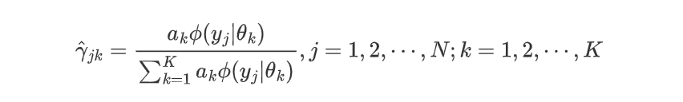
   
3. M步：计算新一轮迭代的模型参数
   
   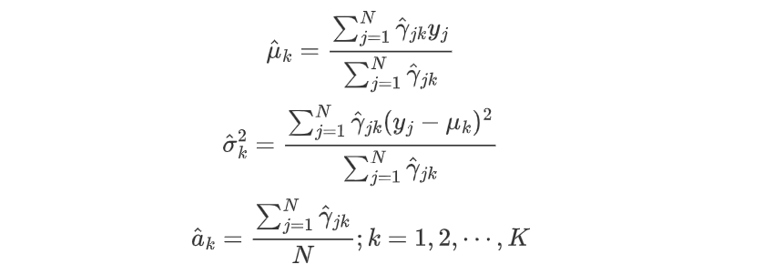
   
4. 重复2，3步直到收敛

## GEM算法

待完善

## EM-GMM代码

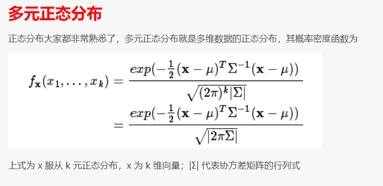

```python
from scipy.special import logsumexp
from scipy.stats import multivariate_normal
from sklearn import mixture
import numpy as np

def log_prob(x, mu, cov):
    norm = multivariate_normal(mean=mu, cov=cov)
    return norm.logpdf(x)


def log_weight_prob(x, alpha, mu, cov):
    N = x.shape[0]
    return np.mat(np.log(alpha) + log_prob(x, mu, cov)).reshape([N, 1])


class GMM(object):
    def __init__(self, k, tol = 1e-3, reg_covar = 1e-7):
        self.K = k
        self.tol = tol
        self.reg_covar=reg_covar
        self.times = 100
        self.loglike = 0


    def fit(self, trainMat):
        self.X = trainMat
        self.N, self.D = trainMat.shape
        self.GMM_EM()

    # gmm入口
    def GMM_EM(self):
        self.scale_data()
        self.init_params()
        for i in range(self.times):
            log_prob_norm, self.gamma = self.e_step(self.X)
            self.mu, self.cov, self.alpha = self.m_step()
            newloglike = self.loglikelihood(log_prob_norm)
            # print(newloglike)
            if abs(newloglike - self.loglike) < self.tol:
                break
            self.loglike = newloglike

    #预测类别
    def predict(self, testMat):
        log_prob_norm, gamma = self.e_step(testMat)
        category = gamma.argmax(axis=1).flatten().tolist()[0]
        return np.array(category)


    #e步，估计gamma
    def e_step(self, data):
        gamma_log_prob = np.mat(np.zeros((self.N, self.K)))
        
        for k in range(self.K):
            gamma_log_prob[:, k] =log_weight_prob(data, self.alpha[k], self.mu[k], self.cov[k])
        log_prob_norm = logsumexp(gamma_log_prob, axis=1)
        log_gamma = gamma_log_prob - log_prob_norm[:, np.newaxis]
        return log_prob_norm, np.exp(log_gamma)


    #m步，最大化loglikelihood
    def m_step(self):
        newmu = np.zeros([self.K, self.D])
        newcov = []
        newalpha = np.zeros(self.K)
        for k in range(self.K):
            Nk = np.sum(self.gamma[:, k])
            newmu[k, :] = np.dot(self.gamma[:, k].T, self.X) / Nk
            cov_k = self.compute_cov(k, Nk)
            newcov.append(cov_k)
            newalpha[k] = Nk / self.N

        newcov = np.array(newcov)
        return newmu, newcov, newalpha


    #计算cov，防止非正定矩阵reg_covar
    def compute_cov(self, k, Nk):
        diff = np.mat(self.X - self.mu[k])
        cov = np.array(diff.T * np.multiply(diff, self.gamma[:,k]) / Nk)
        cov.flat[::self.D + 1] += self.reg_covar
        return cov


    #数据预处理
    def scale_data(self):
        for d in range(self.D):
            max_ = self.X[:, d].max()
            min_ = self.X[:, d].min()
            self.X[:, d] = (self.X[:, d] - min_) / (max_ - min_)
        self.xj_mean = np.mean(self.X, axis=0)
        self.xj_s = np.sqrt(np.var(self.X, axis=0))


    #初始化参数
    def init_params(self):
        self.mu = np.random.rand(self.K, self.D)
        self.cov = np.array([np.eye(self.D)] * self.K) * 0.1
        self.alpha = np.array([1.0 / self.K] * self.K)


    #log近似算法，可以防止underflow，overflow
    def loglikelihood(self, log_prob_norm):
        return np.sum(log_prob_norm)

```

```python
def checkResult():  
    dataMat = []#输入矩阵
    fr = open("./em_amixi_est.txt")
    for line in fr.readlines():
        lineArr = line.strip().split(' ')
        dataMat.append([float(lineArr[0]), float(lineArr[1])])
    #列表转矩阵
    X=np.array(dataMat).T.transpose()
    searchK = 4
    epoch = 5
    maxLogLikelihood = 0
    maxResult = None
    maxK = 0
    alpha = None
    for i in range(2, searchK):
        k = i
        for j in range(epoch):
            model1 = GMM(k)
            model1.fit(X)
            if model1.loglike > maxLogLikelihood:
                maxLogLikelihood = model1.loglike
                maxResult = model1.predict(X)
                maxK = k
                alpha = model1.alpha

    alpha, maxResult = changeLabel(alpha, maxResult)
    print("my gmm k = %s, alpha = %s, maxloglike = %s"%(maxK,[round(a, 5) for a in alpha],maxLogLikelihood))


    model2 = mixture.BayesianGaussianMixture(n_components=maxK,covariance_type='full')
    result2 = model2.fit_predict(X)
    alpha2, result2 = changeLabel(model2.weights_.tolist(), result2)

    result = np.sum(maxResult==result2)
    percent = np.mean(maxResult==result2)
    print("sklearn gmm k = %s, alpha = %s, maxloglike = %s"%(maxK,[round(a, 5) for a in alpha2],model2.lower_bound_))

    print("succ = %s/%s"%(result, len(result2)))
    print("succ = %s"%(percent))

    print(maxResult[:100])
    print(result2[:100])


def changeLabel(alpha, predict):
    alphaSorted = sorted(alpha, reverse=True)
    labelOld = []
    for i in predict:
        if i not in labelOld:
            labelOld.append(i)
        if len(labelOld) == len(alpha):
            break
    labelNew = sorted(labelOld)
    for i, old in enumerate(labelOld):
        predict[predict == old] = labelNew[i] + 100
    return alphaSorted, predict - 100


if __name__ == "__main__":
    checkResult()
```

代码转载自 [EM](https://github.com/SmallVagetable/machine_learning_python/blob/master/em/gmm.py)

[一元EM-GMM实现](https://datawhalechina.github.io/statistical-learning-method-solutions-manual/#/chapter09/chapter09)

